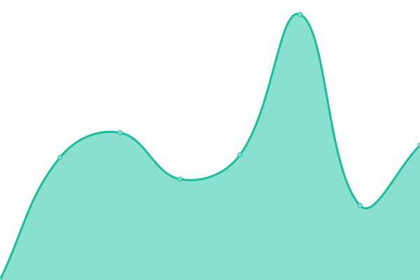
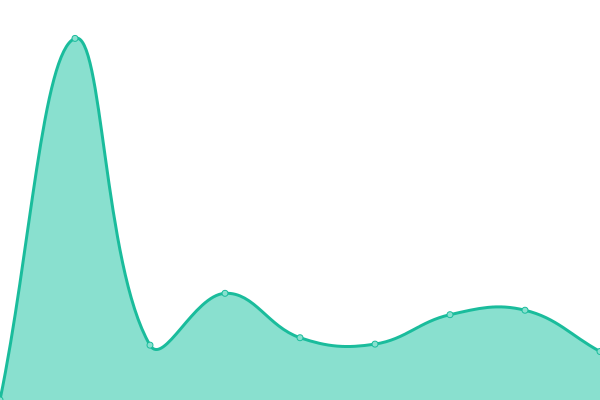
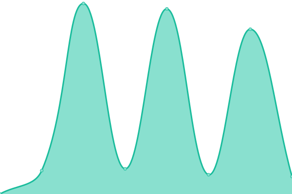

# [📈 Live Status](https://status.linkwaveconnect.com.br): <!--live status--> **🟧 Partial outage**

This repository contains the open-source uptime monitor and status page for [LinkWave Connect](https://git.openwave.net.br/linkwaveconnect), powered by [Upptime](https://github.com/upptime/upptime).

With [Upptime](https://upptime.js.org), you can get your own unlimited and free uptime monitor and status page, powered entirely by a GitHub repository. We use [Issues](https://github.com/linkwaveconnect/status/issues) as incident reports, [Actions](https://github.com/linkwaveconnect/status/actions) as uptime monitors, and [Pages](https://status.linkwaveconnect.com.br) for the status page.

<!--start: status pages-->
<!-- This summary is generated by Upptime (https://github.com/upptime/upptime) -->
<!-- Do not edit this manually, your changes will be overwritten -->
<!-- prettier-ignore -->
| URL | Status | History | Response Time | Uptime |
| --- | ------ | ------- | ------------- | ------ |
|  [LinkWave Connect](https://linkwaveconnect.com.br) | 🟩 Up | [link-wave-connect.yml](https://github.com/linkwaveconnect/status/commits/HEAD/history/link-wave-connect.yml) | 

 2672ms
     
 | 

<a href="https://status.linkwaveconnect.com.br/history/link-wave-connect">100.00%</a>
    

|  LinkWave Marketing | 🟩 Up | [link-wave-marketing.yml](https://github.com/linkwaveconnect/status/commits/HEAD/history/link-wave-marketing.yml) | 

 344ms
     
 | 

<a href="https://status.linkwaveconnect.com.br/history/link-wave-marketing">100.00%</a>
    

|  LinkWave TI | 🟩 Up | [link-wave-ti.yml](https://github.com/linkwaveconnect/status/commits/HEAD/history/link-wave-ti.yml) | 

 756ms
     
 | 

<a href="https://status.linkwaveconnect.com.br/history/link-wave-ti">100.00%</a>
    

|  [Portal LinkWave / Conta Linkwave (LinkWave Account)](https://web.linkwaveconnect.com.br) | 🟩 Up | [portal-link-wave-conta-linkwave-link-wave-account.yml](https://github.com/linkwaveconnect/status/commits/HEAD/history/portal-link-wave-conta-linkwave-link-wave-account.yml) | 

 2825ms
     
 | 

<a href="https://status.linkwaveconnect.com.br/history/portal-link-wave-conta-linkwave-link-wave-account">100.00%</a>
    

|  [OpenWave SpeedTest](https://speed.openwave.net.br) | 🟩 Up | [open-wave-speed-test.yml](https://github.com/linkwaveconnect/status/commits/HEAD/history/open-wave-speed-test.yml) | 

 3560ms
     
 | 

<a href="https://status.linkwaveconnect.com.br/history/open-wave-speed-test">100.00%</a>
    

|  [GitWave](https://git.openwave.net.br) | 🟩 Up | [git-wave.yml](https://github.com/linkwaveconnect/status/commits/HEAD/history/git-wave.yml) | 

 2433ms
     
 | 

<a href="https://status.linkwaveconnect.com.br/history/git-wave">100.00%</a>
    

|  [KanWave](https://kan.linkwaveconnect.com.br) | 🟩 Up | [kan-wave.yml](https://github.com/linkwaveconnect/status/commits/HEAD/history/kan-wave.yml) | 

 808ms
     
 | 

<a href="https://status.linkwaveconnect.com.br/history/kan-wave">100.00%</a>
    

|  [LinkBin](https://bin.openwave.net.br) | 🟥 Down | [link-bin.yml](https://github.com/linkwaveconnect/status/commits/HEAD/history/link-bin.yml) | 

 5742ms
     
 | 

<a href="https://status.linkwaveconnect.com.br/history/link-bin">2.21%</a>
    

<!--end: status pages-->

[**Visit our status website →**](https://status.linkwaveconnect.com.br)

## 📄 License

- Powered by: [Upptime](https://github.com/upptime/upptime)
- Code: [MIT](./LICENSE) © [Anand Chowdhary](https://anandchowdhary.com), supported by [Pabio](https://pabio.com)
- Data in the `./history` directory: [Open Database License](https://opendatacommons.org/licenses/odbl/1-0/)
