# [📈 Live Status](https://status.linkwaveconnect.com.br): <!--live status--> **🟧 Partial outage**

This repository contains the open-source uptime monitor and status page for [LinkWave Connect](https://linkwaveconnect.com.br), powered by [Upptime](https://github.com/upptime/upptime).

With [Upptime](https://upptime.js.org), you can get your own unlimited and free uptime monitor and status page, powered entirely by a GitHub repository. We use [Issues](https://github.com/linkwaveconnect/status/issues) as incident reports, [Actions](https://github.com/linkwaveconnect/status/actions) as uptime monitors, and [Pages](https://status.linkwaveconnect.com.br) for the status page.

<!--start: status pages-->
<!-- This summary is generated by Upptime (https://github.com/upptime/upptime) -->
<!-- Do not edit this manually, your changes will be overwritten -->
<!-- prettier-ignore -->
| URL | Status | History | Response Time | Uptime |
| --- | ------ | ------- | ------------- | ------ |
|  [LinkWave Connect](https://linkwaveconnect.com.br) | Offline | [link-wave-connect.yml](https://github.com/linkwaveconnect/status/commits/HEAD/history/link-wave-connect.yml) | 

 1333ms
     
 | 

<a href="https://status.linkwaveconnect.com.br/history/link-wave-connect">93.64%</a>
    

|  [LinkWave Connect EN](https://en.linkwaveconnect.com.br) | Offline | [link-wave-connect-en.yml](https://github.com/linkwaveconnect/status/commits/HEAD/history/link-wave-connect-en.yml) | 

 1385ms
     
 | 

<a href="https://status.linkwaveconnect.com.br/history/link-wave-connect-en">93.64%</a>
    

|  [LinkWave Portal / Accounts](https://web.linkwaveconnect.com.br) | Online | [link-wave-portal-accounts.yml](https://github.com/linkwaveconnect/status/commits/HEAD/history/link-wave-portal-accounts.yml) | 

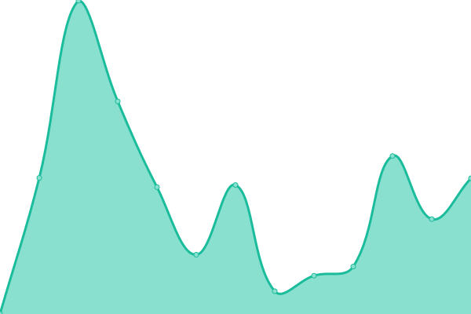 1891ms
     
 | 

<a href="https://status.linkwaveconnect.com.br/history/link-wave-portal-accounts">84.58%</a>
    

|  [LinkWave Search](https://search.linkwaveconnect.com.br) | Online | [link-wave-search.yml](https://github.com/linkwaveconnect/status/commits/HEAD/history/link-wave-search.yml) | 

 392ms
     
 | 

<a href="https://status.linkwaveconnect.com.br/history/link-wave-search">96.71%</a>
    

|  [GitWave](https://git.linkwaveconnect.com.br) | Offline | [git-wave.yml](https://github.com/linkwaveconnect/status/commits/HEAD/history/git-wave.yml) | 

 357ms
     
 | 

<a href="https://status.linkwaveconnect.com.br/history/git-wave">70.28%</a>
    

|  [LinkWave PrivateBin](https://bin.linkwaveconnect.com.br) | Online | [link-wave-private-bin.yml](https://github.com/linkwaveconnect/status/commits/HEAD/history/link-wave-private-bin.yml) | 

 416ms
     
 | 

<a href="https://status.linkwaveconnect.com.br/history/link-wave-private-bin">96.72%</a>
    

|  [LinkWave Podcasts](https://pod.ti.linkwaveconnect.com.br) | Offline | [link-wave-podcasts.yml](https://github.com/linkwaveconnect/status/commits/HEAD/history/link-wave-podcasts.yml) | 

 449ms
     
 | 

<a href="https://status.linkwaveconnect.com.br/history/link-wave-podcasts">93.67%</a>
    

|  [LinkWave Status](https://status.linkwaveconnect.com.br) | Online | [link-wave-status.yml](https://github.com/linkwaveconnect/status/commits/HEAD/history/link-wave-status.yml) | 

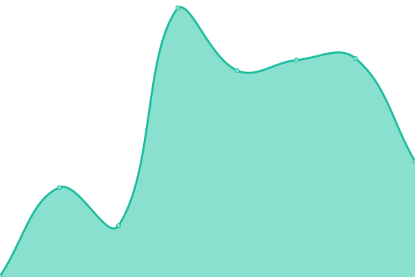 327ms
     
 | 

<a href="https://status.linkwaveconnect.com.br/history/link-wave-status">100.00%</a>
    

|  Nameserver 1 | Online | [nameserver-1.yml](https://github.com/linkwaveconnect/status/commits/HEAD/history/nameserver-1.yml) | 

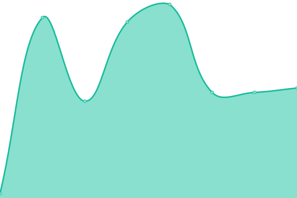 35ms
     
 | 

<a href="https://status.linkwaveconnect.com.br/history/nameserver-1">100.00%</a>
    

|  Nameserver 2 | Online | [nameserver-2.yml](https://github.com/linkwaveconnect/status/commits/HEAD/history/nameserver-2.yml) | 

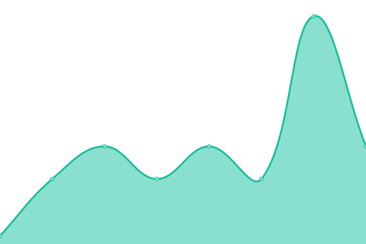 14ms
     
 | 

<a href="https://status.linkwaveconnect.com.br/history/nameserver-2">100.00%</a>
    

|  Open Source Hosting Server | Online | [open-source-hosting-server.yml](https://github.com/linkwaveconnect/status/commits/HEAD/history/open-source-hosting-server.yml) | 

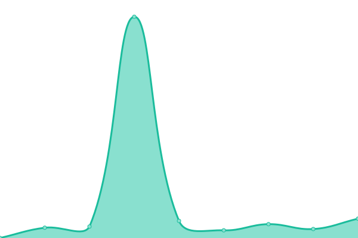 968ms
     
 | 

<a href="https://status.linkwaveconnect.com.br/history/open-source-hosting-server">96.73%</a>
    

|  Nameserver 5 (LKW1) | Online | [nameserver-5-lkw-1.yml](https://github.com/linkwaveconnect/status/commits/HEAD/history/nameserver-5-lkw-1.yml) | 

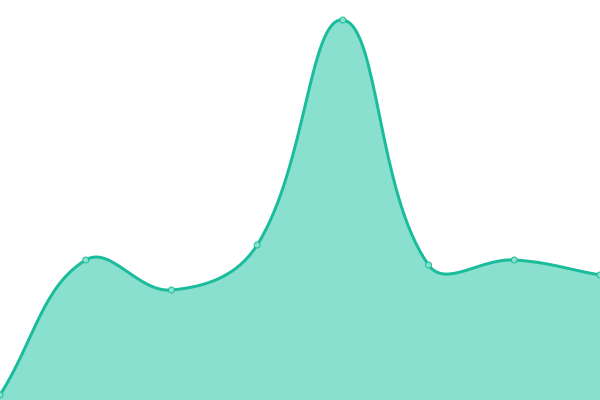 80ms
     
 | 

<a href="https://status.linkwaveconnect.com.br/history/nameserver-5-lkw-1">100.00%</a>
    

|  Nameserver 6 (LKW1) | Online | [nameserver-6-lkw-1.yml](https://github.com/linkwaveconnect/status/commits/HEAD/history/nameserver-6-lkw-1.yml) | 

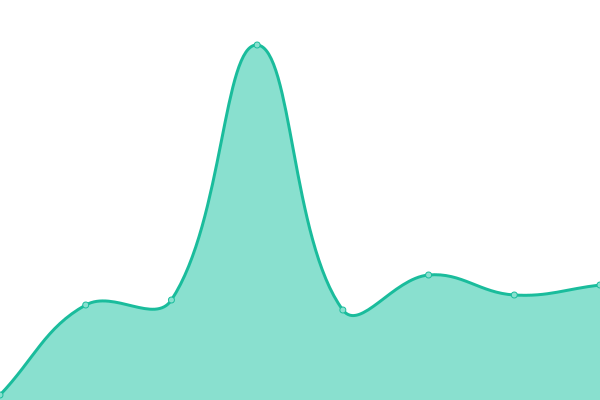 118ms
     
 | 

<a href="https://status.linkwaveconnect.com.br/history/nameserver-6-lkw-1">100.00%</a>
    

|  Cpanel (LKW1) | Online | [cpanel-lkw-1.yml](https://github.com/linkwaveconnect/status/commits/HEAD/history/cpanel-lkw-1.yml) | 

 616ms
     
 | 

<a href="https://status.linkwaveconnect.com.br/history/cpanel-lkw-1">98.46%</a>
    

|  Webmail (LKW1) | Online | [webmail-lkw-1.yml](https://github.com/linkwaveconnect/status/commits/HEAD/history/webmail-lkw-1.yml) | 

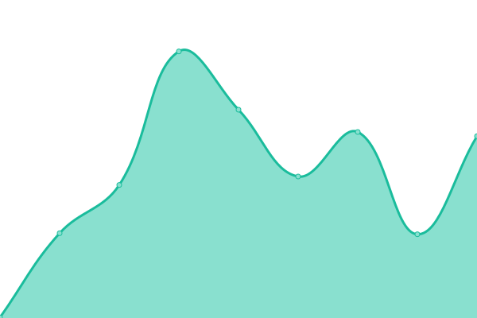 721ms
     
 | 

<a href="https://status.linkwaveconnect.com.br/history/webmail-lkw-1">98.47%</a>
    

|  IMAP (LKW1) (SSL/TLS) | Online | [imap-lkw-1-ssl-tls.yml](https://github.com/linkwaveconnect/status/commits/HEAD/history/imap-lkw-1-ssl-tls.yml) | 

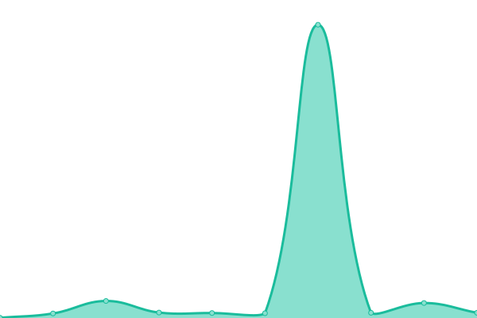 155ms
     
 | 

<a href="https://status.linkwaveconnect.com.br/history/imap-lkw-1-ssl-tls">100.00%</a>
    

|  IMAP (LKW1) (Insecure) | Online | [imap-lkw-1-insecure.yml](https://github.com/linkwaveconnect/status/commits/HEAD/history/imap-lkw-1-insecure.yml) | 

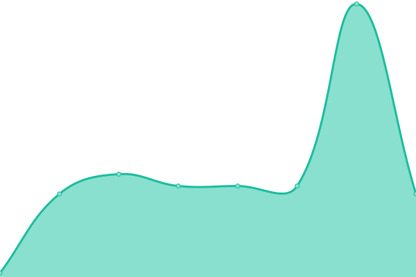 44ms
     
 | 

<a href="https://status.linkwaveconnect.com.br/history/imap-lkw-1-insecure">100.00%</a>
    

|  POP3 (LKW1) (SSL/TLS) | Online | [pop-3-lkw-1-ssl-tls.yml](https://github.com/linkwaveconnect/status/commits/HEAD/history/pop-3-lkw-1-ssl-tls.yml) | 

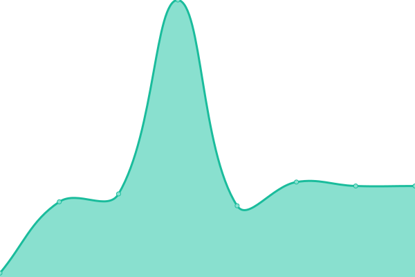 62ms
     
 | 

<a href="https://status.linkwaveconnect.com.br/history/pop-3-lkw-1-ssl-tls">100.00%</a>
    

|  POP3 (LKW1) (Insecure) | Online | [pop-3-lkw-1-insecure.yml](https://github.com/linkwaveconnect/status/commits/HEAD/history/pop-3-lkw-1-insecure.yml) | 

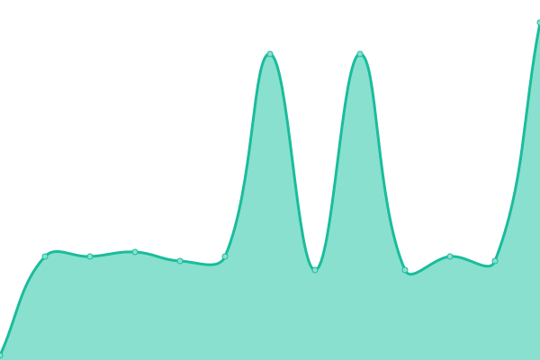 80ms
     
 | 

<a href="https://status.linkwaveconnect.com.br/history/pop-3-lkw-1-insecure">100.00%</a>
    

|  SMTP (LKW1) (SSL/TLS) | Online | [smtp-lkw-1-ssl-tls.yml](https://github.com/linkwaveconnect/status/commits/HEAD/history/smtp-lkw-1-ssl-tls.yml) | 

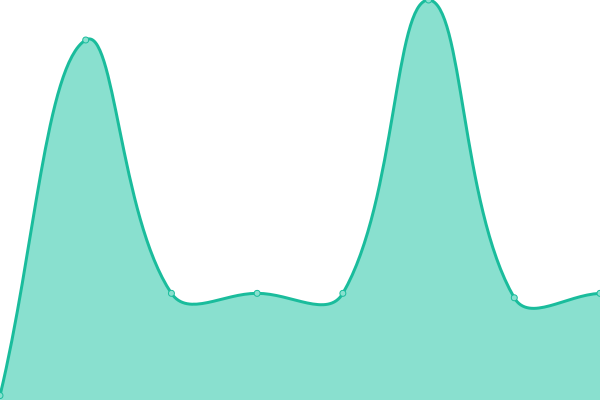 138ms
     
 | 

<a href="https://status.linkwaveconnect.com.br/history/smtp-lkw-1-ssl-tls">100.00%</a>
    

|  SMTP (LKW1) (Insecure) | Online | [smtp-lkw-1-insecure.yml](https://github.com/linkwaveconnect/status/commits/HEAD/history/smtp-lkw-1-insecure.yml) | 

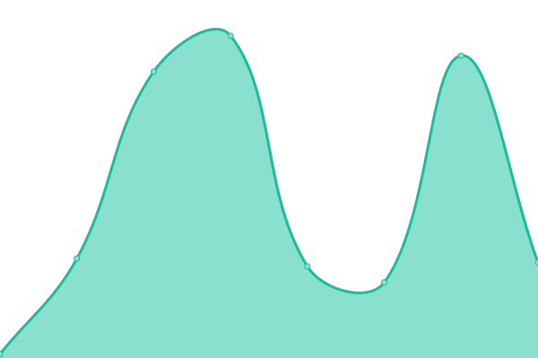 80ms
     
 | 

<a href="https://status.linkwaveconnect.com.br/history/smtp-lkw-1-insecure">100.00%</a>
    

|  FTP (LKW1) (Insecure) | Online | [ftp-lkw-1-insecure.yml](https://github.com/linkwaveconnect/status/commits/HEAD/history/ftp-lkw-1-insecure.yml) | 

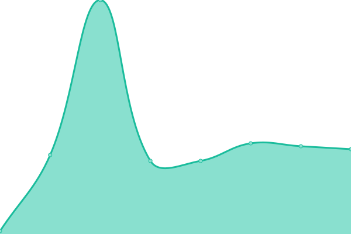 118ms
     
 | 

<a href="https://status.linkwaveconnect.com.br/history/ftp-lkw-1-insecure">100.00%</a>
    

|  CalDav (LKW1) (SSL/TLS) | Online | [cal-dav-lkw-1-ssl-tls.yml](https://github.com/linkwaveconnect/status/commits/HEAD/history/cal-dav-lkw-1-ssl-tls.yml) | 

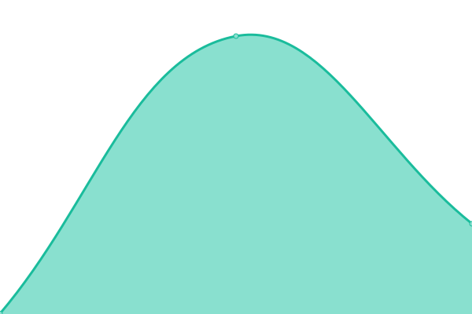 127ms
     
 | 

<a href="https://status.linkwaveconnect.com.br/history/cal-dav-lkw-1-ssl-tls">100.00%</a>
    

|  CardDav (LKW1) (SSL/TLS) | Online | [card-dav-lkw-1-ssl-tls.yml](https://github.com/linkwaveconnect/status/commits/HEAD/history/card-dav-lkw-1-ssl-tls.yml) | 

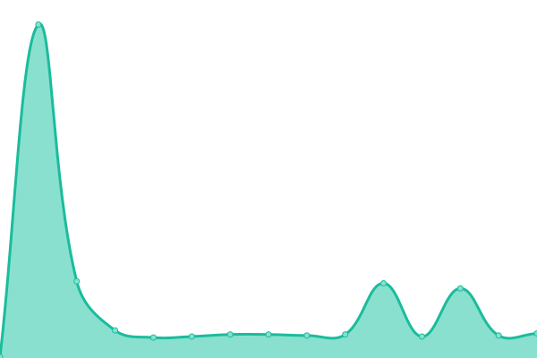 126ms
     
 | 

<a href="https://status.linkwaveconnect.com.br/history/card-dav-lkw-1-ssl-tls">100.00%</a>
    

|  WebDav (LKW1) (SSL/TLS) | Online | [web-dav-lkw-1-ssl-tls.yml](https://github.com/linkwaveconnect/status/commits/HEAD/history/web-dav-lkw-1-ssl-tls.yml) | 

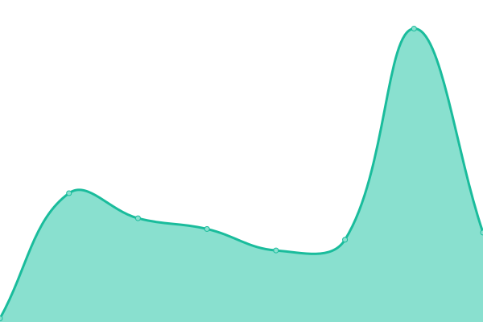 47ms
     
 | 

<a href="https://status.linkwaveconnect.com.br/history/web-dav-lkw-1-ssl-tls">100.00%</a>
    

<!--end: status pages-->

[**Visit our status website →**](https://status.linkwaveconnect.com.br)

## 📄 License

- Powered by: [Upptime](https://github.com/upptime/upptime)
- Code: [MIT](./LICENSE) © [Anand Chowdhary](https://anandchowdhary.com), supported by [Pabio](https://pabio.com)
- Data in the `./history` directory: [Open Database License](https://opendatacommons.org/licenses/odbl/1-0/)
