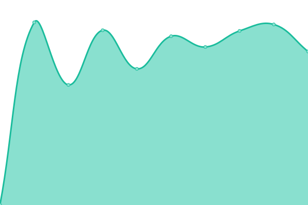
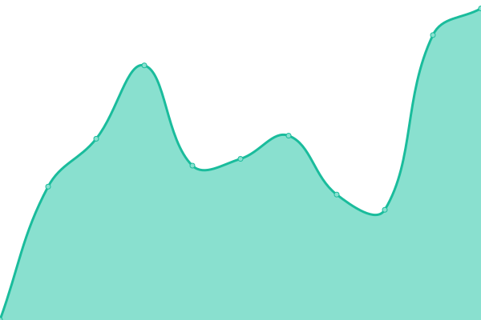
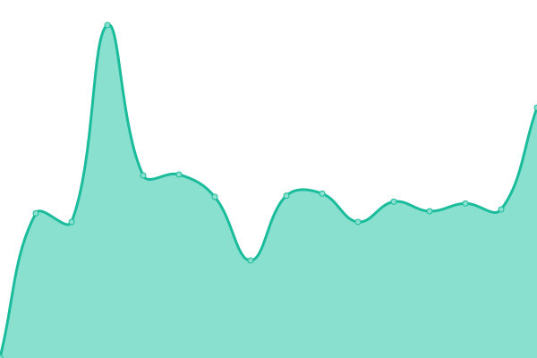
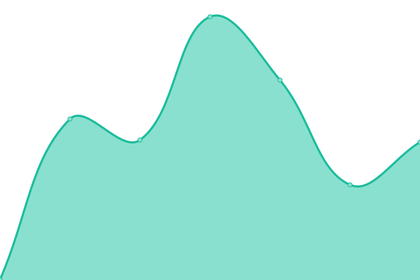
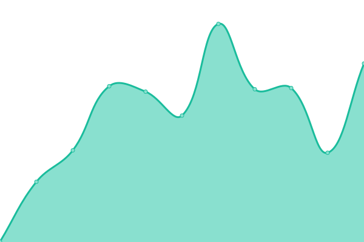
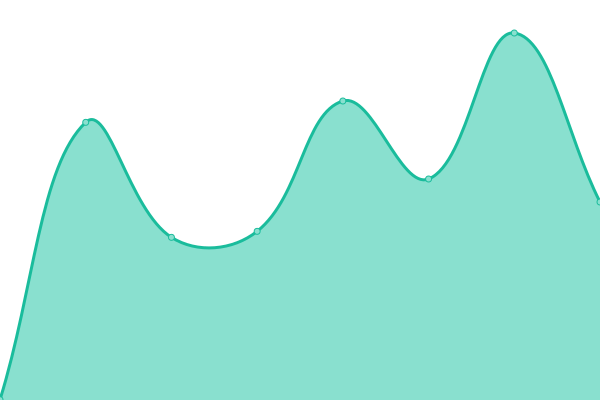

# [📈 Live Status](https://status.linkwaveconnect.com.br): <!--live status--> **🟧 Partial outage**

This repository contains the open-source uptime monitor and status page for [LinkWave Connect](https://linkwaveconnect.com.br), powered by [Upptime](https://github.com/upptime/upptime).

With [Upptime](https://upptime.js.org), you can get your own unlimited and free uptime monitor and status page, powered entirely by a GitHub repository. We use [Issues](https://github.com/linkwaveconnect/status/issues) as incident reports, [Actions](https://github.com/linkwaveconnect/status/actions) as uptime monitors, and [Pages](https://status.linkwaveconnect.com.br) for the status page.

<!--start: status pages-->
<!-- This summary is generated by Upptime (https://github.com/upptime/upptime) -->
<!-- Do not edit this manually, your changes will be overwritten -->
<!-- prettier-ignore -->
| URL | Status | History | Response Time | Uptime |
| --- | ------ | ------- | ------------- | ------ |
|  [LinkWave Connect](https://linkwaveconnect.com.br) | Online | [link-wave-connect.yml](https://github.com/linkwaveconnect/status/commits/HEAD/history/link-wave-connect.yml) | 

 992ms
     
 | 

<a href="https://status.linkwaveconnect.com.br/history/link-wave-connect">100.00%</a>
    

|  [LinkWave Connect EN](https://en.linkwaveconnect.com.br) | Online | [link-wave-connect-en.yml](https://github.com/linkwaveconnect/status/commits/HEAD/history/link-wave-connect-en.yml) | 

 1042ms
     
 | 

<a href="https://status.linkwaveconnect.com.br/history/link-wave-connect-en">100.00%</a>
    

|  [LinkWave Portal](https://web.linkwaveconnect.com.br) | Online | [link-wave-portal.yml](https://github.com/linkwaveconnect/status/commits/HEAD/history/link-wave-portal.yml) | 

 485ms
     
 | 

<a href="https://status.linkwaveconnect.com.br/history/link-wave-portal">100.00%</a>
    

|  [LinkWave Search](https://search.linkwaveconnect.com.br) | Online | [link-wave-search.yml](https://github.com/linkwaveconnect/status/commits/HEAD/history/link-wave-search.yml) | 

 460ms
     
 | 

<a href="https://status.linkwaveconnect.com.br/history/link-wave-search">100.00%</a>
    

|  [LinkWave PrivateBin](https://bin.linkwaveconnect.com.br) | Online | [link-wave-private-bin.yml](https://github.com/linkwaveconnect/status/commits/HEAD/history/link-wave-private-bin.yml) | 

 249ms
     
 | 

<a href="https://status.linkwaveconnect.com.br/history/link-wave-private-bin">100.00%</a>
    

|  [LinkWave Podcasts](https://pod.ti.linkwaveconnect.com.br) | Online | [link-wave-podcasts.yml](https://github.com/linkwaveconnect/status/commits/HEAD/history/link-wave-podcasts.yml) | 

 193ms
     
 | 

<a href="https://status.linkwaveconnect.com.br/history/link-wave-podcasts">100.00%</a>
    

|  Open Source Hosting | Offline | [open-source-hosting.yml](https://github.com/linkwaveconnect/status/commits/HEAD/history/open-source-hosting.yml) | 

 0ms
     
 | 

<a href="https://status.linkwaveconnect.com.br/history/open-source-hosting">10.13%</a>
    

<!--end: status pages-->

[**Visit our status website →**](https://status.linkwaveconnect.com.br)

## 📄 License

- Powered by: [Upptime](https://github.com/upptime/upptime)
- Code: [MIT](./LICENSE) © [Anand Chowdhary](https://anandchowdhary.com), supported by [Pabio](https://pabio.com)
- Data in the `./history` directory: [Open Database License](https://opendatacommons.org/licenses/odbl/1-0/)
