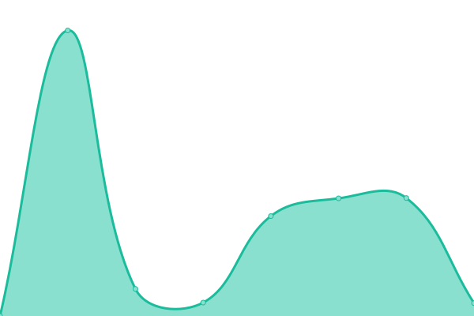
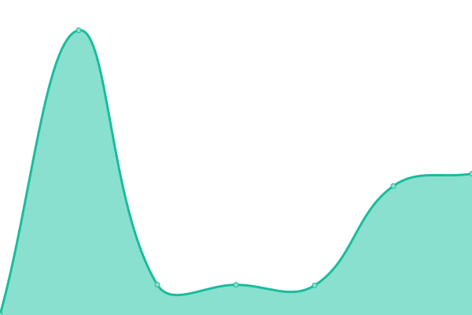

# [📈 Live Status](https://status.linkwaveconnect.com.br): <!--live status--> **🟩 All systems operational**

This repository contains the open-source uptime monitor and status page for [LinkWave Connect](https://git.openwave.net.br/linkwaveconnect), powered by [Upptime](https://github.com/upptime/upptime).

With [Upptime](https://upptime.js.org), you can get your own unlimited and free uptime monitor and status page, powered entirely by a GitHub repository. We use [Issues](https://github.com/linkwaveconnect/status/issues) as incident reports, [Actions](https://github.com/linkwaveconnect/status/actions) as uptime monitors, and [Pages](https://status.linkwaveconnect.com.br) for the status page.

<!--start: status pages-->
<!-- This summary is generated by Upptime (https://github.com/upptime/upptime) -->
<!-- Do not edit this manually, your changes will be overwritten -->
<!-- prettier-ignore -->
| URL | Status | History | Response Time | Uptime |
| --- | ------ | ------- | ------------- | ------ |
|  [LinkWave Connect](https://linkwaveconnect.com.br) | 🟩 Up | [link-wave-connect.yml](https://github.com/linkwaveconnect/status/commits/HEAD/history/link-wave-connect.yml) | 

 2140ms
     
 | 

<a href="https://status.linkwaveconnect.com.br/history/link-wave-connect">99.82%</a>
    

|  [Portal LinkWave](https://web.linkwaveconnect.com.br) | 🟩 Up | [portal-link-wave.yml](https://github.com/linkwaveconnect/status/commits/HEAD/history/portal-link-wave.yml) | 

 3776ms
     
 | 

<a href="https://status.linkwaveconnect.com.br/history/portal-link-wave">99.82%</a>
    

|  [LinkWave Search](https://search.linkwaveconnect.com.br) | 🟩 Up | [link-wave-search.yml](https://github.com/linkwaveconnect/status/commits/HEAD/history/link-wave-search.yml) | 

 866ms
     
 | 

<a href="https://status.linkwaveconnect.com.br/history/link-wave-search">99.82%</a>
    

|  LinkWave Marketing | 🟩 Up | [link-wave-marketing.yml](https://github.com/linkwaveconnect/status/commits/HEAD/history/link-wave-marketing.yml) | 

 656ms
     
 | 

<a href="https://status.linkwaveconnect.com.br/history/link-wave-marketing">99.83%</a>
    

|  LinkWave TI | 🟩 Up | [link-wave-ti.yml](https://github.com/linkwaveconnect/status/commits/HEAD/history/link-wave-ti.yml) | 

 1602ms
     
 | 

<a href="https://status.linkwaveconnect.com.br/history/link-wave-ti">99.83%</a>
    

|  [Conta OpenWave (OpenWave Account)](https://account.openwave.net.br) | 🟩 Up | [conta-open-wave-open-wave-account.yml](https://github.com/linkwaveconnect/status/commits/HEAD/history/conta-open-wave-open-wave-account.yml) | 

 4510ms
     
 | 

<a href="https://status.linkwaveconnect.com.br/history/conta-open-wave-open-wave-account">99.53%</a>
    

|  [OpenWave Cloud](https://cloud.openwave.net.br) | 🟩 Up | [open-wave-cloud.yml](https://github.com/linkwaveconnect/status/commits/HEAD/history/open-wave-cloud.yml) | 

 7069ms
     
 | 

<a href="https://status.linkwaveconnect.com.br/history/open-wave-cloud">98.78%</a>
    

|  [GitWave](https://git.openwave.net.br) | 🟩 Up | [git-wave.yml](https://github.com/linkwaveconnect/status/commits/HEAD/history/git-wave.yml) | 

 2292ms
     
 | 

<a href="https://status.linkwaveconnect.com.br/history/git-wave">99.83%</a>
    

|  [OpenWave Music](https://open.openwave.net.br) | 🟩 Up | [open-wave-music.yml](https://github.com/linkwaveconnect/status/commits/HEAD/history/open-wave-music.yml) | 

 3815ms
     
 | 

<a href="https://status.linkwaveconnect.com.br/history/open-wave-music">99.83%</a>
    

|  [KanWave](https://kan.openwave.net.br) | 🟩 Up | [kan-wave.yml](https://github.com/linkwaveconnect/status/commits/HEAD/history/kan-wave.yml) | 

 1274ms
     
 | 

<a href="https://status.linkwaveconnect.com.br/history/kan-wave">99.84%</a>
    

|  [OpenWave Calendar and Contact Sync](https://cal.openwave.net.br) | 🟩 Up | [open-wave-calendar-and-contact-sync.yml](https://github.com/linkwaveconnect/status/commits/HEAD/history/open-wave-calendar-and-contact-sync.yml) | 

 3266ms
     
 | 

<a href="https://status.linkwaveconnect.com.br/history/open-wave-calendar-and-contact-sync">100.00%</a>
    

|  [OpenWave Certification Authority](https://ca.openwave.net.br) | 🟩 Up | [open-wave-certification-authority.yml](https://github.com/linkwaveconnect/status/commits/HEAD/history/open-wave-certification-authority.yml) | 

 2139ms
     
 | 

<a href="https://status.linkwaveconnect.com.br/history/open-wave-certification-authority">99.84%</a>
    

|  Certificate repository | 🟩 Up | [certificate-repository.yml](https://github.com/linkwaveconnect/status/commits/HEAD/history/certificate-repository.yml) | 

 1097ms
     
 | 

<a href="https://status.linkwaveconnect.com.br/history/certificate-repository">99.85%</a>
    

<!--end: status pages-->

[**Visit our status website →**](https://status.linkwaveconnect.com.br)

## 📄 License

- Powered by: [Upptime](https://github.com/upptime/upptime)
- Code: [MIT](./LICENSE) © [Anand Chowdhary](https://anandchowdhary.com), supported by [Pabio](https://pabio.com)
- Data in the `./history` directory: [Open Database License](https://opendatacommons.org/licenses/odbl/1-0/)
